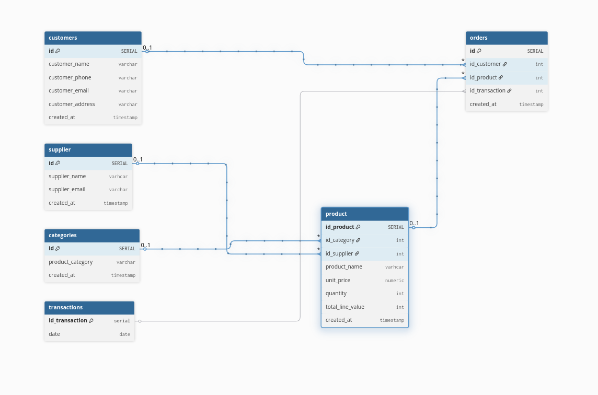

# Indice
* [Intro](#)
* [inilization Doc](#Doc-inilization)


## Doc inilization
```
    1. npm init -y                # to generate the package.json
    2. npm install express        # HTTP server
    3. npm install pg             # PostgreSQL connection
    4. npm install mongoose       # MongoDB connection
    5. npm install xlsx           # reading excel files
    6. npm install dotenv         # environment variables
    7. npm start                  # to start the project


```

## Structure BD


### SQL 
These tables are the most static and tend to be fixed.
*  custommers
* supplier
* categories
* product
* orders

### NoSql
This one is chosen as nosql because it has the most continuous changes
* transaction

## Errors
{"error":"there is no unique or exclusion constraint matching the ON CONFLICT specification"}
se soluciona con 
ADD CONSTRAINT supplier_email_unique UNIQUE (supplier_email);


